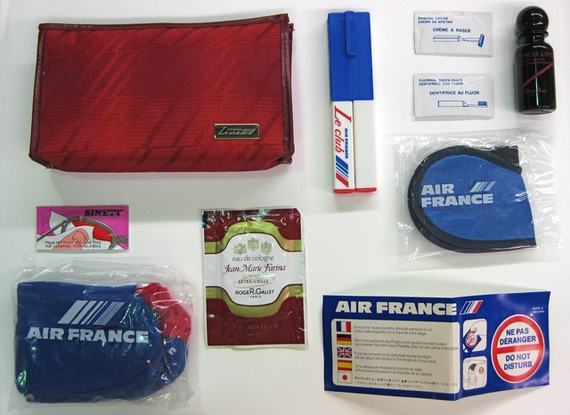
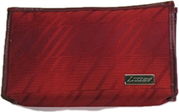
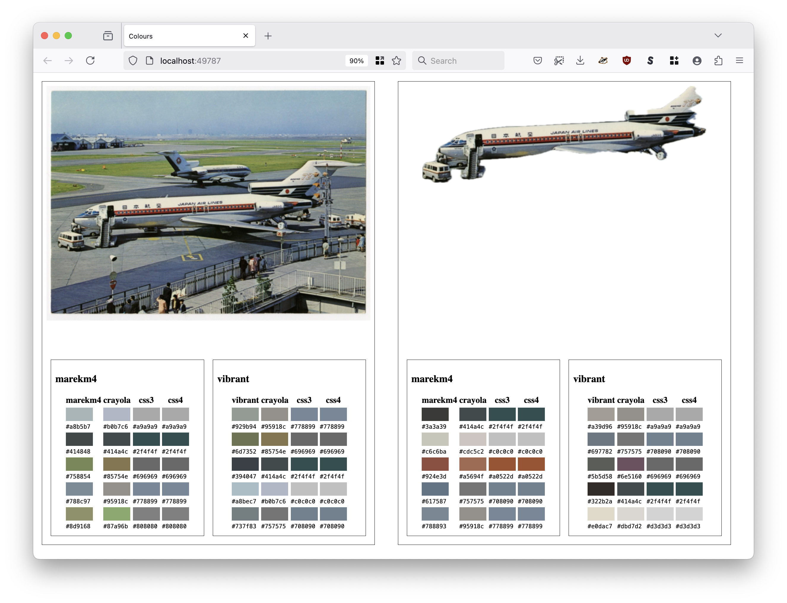

# go-image-emboss

Go package for interacting with the `sfomuseum/swift-image-emboss-grpc` tools

## Documentation

Documentation is incomplete.

## Example

```
import (
       "context"
       
       "github.com/sfomuseum/go-image-emboss"
)

ctx := context.Background()
embosser, _ := emboss.NewEmbosser(ctx, "grpc://localhost:1234")

combined := false

rsp, _ := embosser.EmbossImage(ctx, "example.jpg", combined)

for _, im := range rsp {
	// Do something with im (which is an `image.Image` instance here)
}		
```

## Tools

```
$> make cli
go build -mod vendor -ldflags="-s -w" -o bin/emboss cmd/emboss/main.go
```

### images-emboss

```
$> ./bin/emboss -h
Usage of ./bin/emboss:
  -combined
    	Return a single image combining all the subjects that were derived from an image.
  -embosser-uri string
    	A valid sfomuseum/go-image-emboss.Embosser URI. (default "grpc://localhost:1234")
```

#### Examples

_Note that all these examples assume there is a copy of the [sfomuseum/swift-image-emboss-grpc](https://github.com/sfomuseum/swift-image-emboss-grpc) server instance already running somewhere it can be reached (`localhost:1234` in these examples)._

##### Single object


Given this image of [a tie tack from Civil Air Transport (CAT) airlines](https://collection.sfomuseum.org/objects/1762759391/) passed to the gRPC image embossing service like this:

```
$> ./bin/emboss -embosser-uri grpc://localhost:1234 fixtures/cat-pin.jpg 
2023/10/02 12:13:39 fixtures/cat-pin-emboss-001.png
```

The image embossing service will return this image:


##### Multiple objects



Given this image of [an Air France amenity kit](https://collection.sfomuseum.org/objects/1780469983/) passed to the gRPC image embossing service like this:

```
$> ./bin/emboss -embosser-uri grpc://localhost:1234 fixtures/af-kit.jpg 
2023/10/02 12:17:51 fixtures/af-kit-emboss-001.png
2023/10/02 12:17:51 fixtures/af-kit-emboss-002.png
2023/10/02 12:17:51 fixtures/af-kit-emboss-003.png
2023/10/02 12:17:51 fixtures/af-kit-emboss-004.png
2023/10/02 12:17:51 fixtures/af-kit-emboss-005.png
```

The image embossing service will return the following images:




##### Multiple objects combined

If you want the service to return all those images in a single image passed the `-combined` flag, like this:

```
$> ./bin/emboss -embosser-uri grpc://localhost:1234 -combined fixtures/af-kit.jpg
2023/10/02 12:28:57 fixtures/af-kit-emboss-combined-001.png
```

The image embossing service will return the following image:


### review-colors

Command line tool to perform image segmentation, colour extraction and "snap-to-grid" matching with one or more colour palettes for images.

```
$> ./bin/review-colors -h
  -embosser-uri string
    	A valid sfomuseum/go-image-emboss.Embosser URI. (default "grpc://localhost:8080")
  -extruder-uri value
    	Zero or more aaronland/go-colours/extruder.Extruder URIs. Default is to use all registered extruder schemes.
  -palette-uri value
    	Zero or more aaronland/go-colours/palette.Palette URIs. Default is to use all registered palette schemes.
  -root string
    	The path to a directory where images and HTML files associated with the review should be stored. If empty a new temporary directory will be created (and deleted when the application exits).
  -verbose
    	Enable verbose (debug) logging.
```

_Under the hood this uses the [aaronland/go-colours](https://github.com/aaronland/go-colours) package._

#### Example

First, make you sure you have a copy of the [swfit-image-emboss-grpc](https://github.com/sfomuseum/swift-image-emboss-grpc) server running. This is tool that does the image segmentation.

```
$> cd /usr/local/sfomuseum/swift-image-emboss-grpc
$> swift build
swift builds stuff here...

$> make debug
./.build/debug/image-emboss-grpc-server --logfile true

2025-05-01T15:29:52-0700 info org.sfomuseum.text-emboss-grpc-server : [GRPCServer] server started on port 8080
```

_Note: The `image-emboss-grpc-server` depends on the availability of the Apple [Vision Frameworks](https://developer.apple.com/documentation/vision) so this will only work on Apple hardware._

Next come back to this repository and build the `review-colors` tool. Finally run the `review-colors` tool by passing it the path, or URI, to one or more images.

```
$> cd /usr/local/sfomuseum/go-image-emboss
$> make cli
go build -mod vendor -ldflags="-s -w" -o bin/emboss cmd/emboss/main.go
go build -mod vendor -ldflags="-s -w" -o bin/review-colors cmd/review-colors/main.go

$> ./bin/review-colors  https://static.sfomuseum.org/media/176/271/272/3/1762712723_kriv1bFklzPUdgp3ZapyBmKyPgwfFL0x_z.jpg
2025/05/01 15:30:51 INFO Server is ready and features are viewable url=http://localhost:49787
```

The tool will fetch the image, hand it off to the `image-emboss-grpc-server` to derive sub-images and then extract the dominant colours for each image as well as aligning each colour with its closest match using one or more colour palettes.

And then when you open your browser to `http://localhost:49787` (or whatever URL the `review-colors` tool chooses for you) you see this:



This is all the `review-colors` tool does for the time being. I've considered making a fancy interactive web application but that has not happened yet.

Unless you specify a custom `-root` flag all the images used by the web application (excluding the source images themselves) will be automatically be deleted when you stop the tool.

## See also

* https://github.com/sfomuseum/swift-image-emboss
* https://github.com/sfomuseum/swift-image-emboss-grpc
* https://collection.sfomuseum.org/objects/1762759391/
* https://collection.sfomuseum.org/objects/1780469983/
* https://github.com/aaronland/go-colours