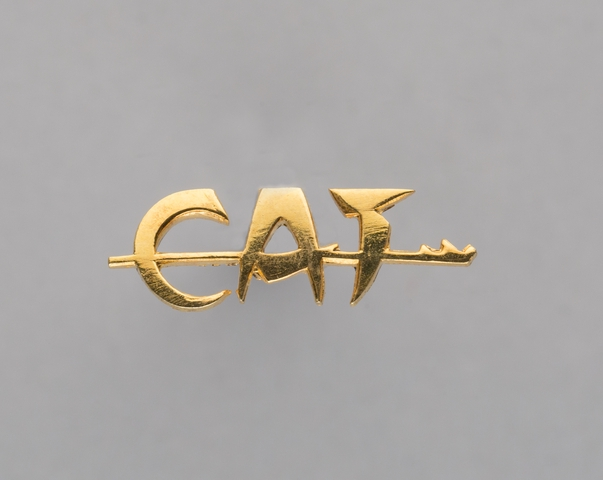

# go-image-emboss

Go package for interacting with the `sfomuseum/swift-image-emboss-grpc` tools

## Documentation

Documentation is incomplete.

## Tools

### images-emboss



```
$> ./bin/emboss -embosser-uri grpc://localhost:1234 fixtures/cat-pin.jpg 
2023/10/02 12:13:39 fixtures/cat-pin-emboss-001.png
```


* https://collection.sfomuseum.org/objects/1762759391/


```
$> ./bin/emboss -embosser-uri grpc://localhost:1234 fixtures/af-kit.jpg 
2023/10/02 12:17:51 fixtures/af-kit-emboss-001.png
2023/10/02 12:17:51 fixtures/af-kit-emboss-002.png
2023/10/02 12:17:51 fixtures/af-kit-emboss-003.png
2023/10/02 12:17:51 fixtures/af-kit-emboss-004.png
2023/10/02 12:17:51 fixtures/af-kit-emboss-005.png
```


https://collection.sfomuseum.org/objects/1780469983/

## See also

* https://github.com/sfomuseum/swift-image-emboss
* https://github.com/sfomuseum/swift-image-emboss-grpc
